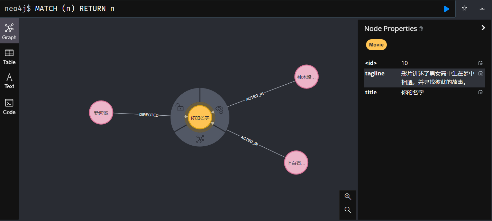
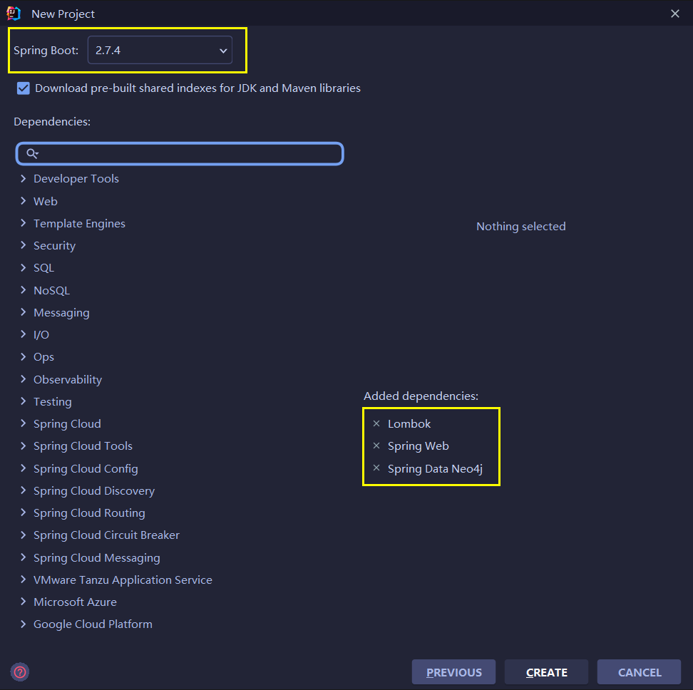
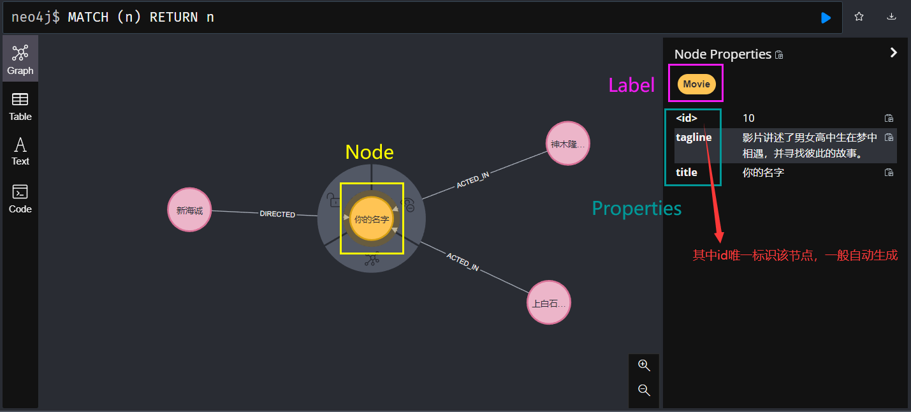
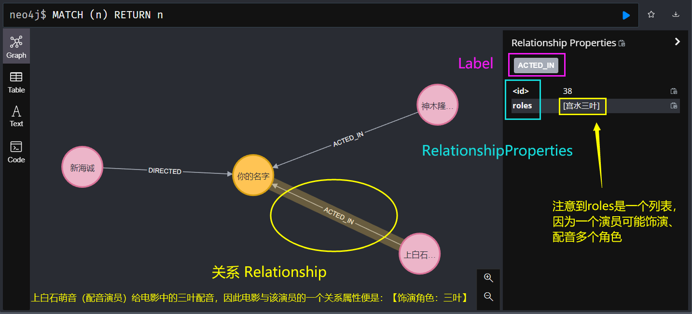

# SpringBoot整合Neo4j，最新版本适用，超通俗详细讲解

## 0.前言

​	跟着班导师做项目的时候遇到社交网络的部分，而传统的关系数据库不能很好解决数据之间的关系，因此采用图数据的方式进行存储。Neo4j算是主流的图数据库，多应用于知识图谱、社交网络等。

​	这两天学习SpringBoot时碰到了很多问题

- [springboot集合neo4j引用了org.neo4j的包，报错Required identifier property not found for class](https://ask.csdn.net/questions/7658608)
- [用SpringBoot集成neo4j，查询报错Could not find mappable nodes or relationships inside Record](https://ask.csdn.net/questions/7659061)
- org.springframework.data.neo4j.core.schema中没有@NodeEntity，@StartNode，@EndNode
- RelationShip无法注解在实体关系类中
- nested exception is org.springframework.beans.BeanInstantiationException: Failed to instantiate [org.*neo4j*.ogm.session.*SessionFactory*] sessionFactory找不到

看了[(128条消息) 【最新】Neo4j官方建议Spring Boot 2.4.及以上版本用Neo4j Java Driver代替The Spring Boot starter_学到一寸是一寸的博客-CSDN博客](https://blog.csdn.net/ccnice99/article/details/123420884)的博客后才知道是因为**SpringBoot版本较高（2.4以上）时集成的Neo4j的API规则方法在变化**。但是他的博客还是没有说明如何使用类似@Node的注解，自己特意去查了Neo4j官方文档和Spring Neo4j的官方文档并进行总结整理发出来。

---------

本文将解决的问题

- SpringBoot高版本（2.4以上）+Neo4j的配置
- 使用@Node等注解操作简化Neo4j
- 一些简单的cypherQuery（很类似MySQL的SQL语句）用法解释
- 利用Repository（类似MyBatisPlus操作的Mapper接口）对图数据进行CRUD
- 不使用Repository而使用Neo4jTemplate直接对图数据进行CRUD

TODO

- id的生成
- 分页查询

---

本文将会结合官网的一个 【导演-电影-演员】关系图来进行实现。以新海诚导演的《你的名字》为例。



## 1.初始化Spring Boot项目添加依赖

**注：本文所使用SpringBoot版本为2.7.4，Java8；（Java8+均可）,neo4j的安装不再赘述，请提前安装配置好**

### 1.初始化项目，添加依赖

指定对应的SpringBoot版本（注意本文适配2.4版本及以上）和相应的依赖，当然也可以后续pom依赖中添加坐标（注意pom有两个neo4j相关的依赖）



```xml
    <parent>
        <groupId>org.springframework.boot</groupId>
        <artifactId>spring-boot-starter-parent</artifactId>
        <version>2.7.4</version>
        <relativePath/> <!-- lookup parent from repository -->
    </parent>
    <groupId>com.example</groupId>
    <artifactId>Neo4jDemo</artifactId>
    <version>0.0.1-SNAPSHOT</version>
    <name>Neo4jDemo</name>
    <description>Neo4jDemo</description>
    <properties>
        <java.version>8</java.version>
    </properties>

    <dependencies>
        <!-- neo4j 驱动 这个需要自己手动添加一下 -->
        <dependency>
            <groupId>org.neo4j.driver</groupId>
            <artifactId>neo4j-java-driver</artifactId>
        </dependency>
        <!-- neo4j 操作实体注解需要 -->
        <dependency>
            <groupId>org.springframework.boot</groupId>
            <artifactId>spring-boot-starter-data-neo4j</artifactId>
        </dependency>

        <dependency>
            <groupId>org.projectlombok</groupId>
            <artifactId>lombok</artifactId>
            <optional>true</optional>
        </dependency>
        <dependency>
            <groupId>org.springframework.boot</groupId>
            <artifactId>spring-boot-starter-test</artifactId>
            <scope>test</scope>
        </dependency>
    </dependencies>
```

### 2.配置Neo4j

```yaml
spring:
  neo4j:
    uri: bolt://<YourNeo4jIpAddress>:7687
    authentication:
      username: <yourUserName>
      password: <yourPassword>
# 指定数据库
  data:
    neo4j:
      database: <yourDatabase>
```

创建`utils`包，并在该包下创建`ExampleCommandLineRunner`来装配Driver和Session

```java
package com.example.neo4jdemo.utils;

import lombok.extern.slf4j.Slf4j;
import org.neo4j.driver.*;
import org.springframework.boot.CommandLineRunner;
import org.springframework.context.ConfigurableApplicationContext;
import org.springframework.context.annotation.Bean;
import org.springframework.stereotype.Component;

@Component
@Slf4j
public class ExampleCommandLineRunner implements CommandLineRunner {

    private final Driver driver;
    private final ConfigurableApplicationContext applicationContext;
    public final Session session;

    @Bean
    Session session(){
        return session;
    }

    // Autowire the Driver bean by constructor injection
    public ExampleCommandLineRunner(Driver driver, ConfigurableApplicationContext applicationContext) {
        this.driver = driver;
        this.applicationContext = applicationContext;
        this.session = driver.session();

    }

    @Override
    public void run(String... args) throws Exception {
    }
}
```

## 2.创建实体类节点

### 1.节点

节点介绍



创建`entity`包，添加实体类：`PersonEntity`

```java
package com.example.neo4jdemo.entity;

import lombok.Data;
import org.springframework.data.neo4j.core.schema.GeneratedValue;
import org.springframework.data.neo4j.core.schema.Id;
import org.springframework.data.neo4j.core.schema.Node;


@Node("Person")
@Data
public class PersonEntity {
    @Id
    @GeneratedValue
    private Long id;
    private String name;
    private Integer born;
    public PersonEntity(Integer born, String name) {
        this.name = name;
        this.born = born;
    }
}

```

### 2.节点间的关系



```java
package com.example.neo4jdemo.entity;

import lombok.Data;
import org.springframework.data.neo4j.core.schema.*;

import java.util.ArrayList;
import java.util.List;

/**
 * Movie实体类，一个neo4j的节点 
 */
@Node(labels = "Movie") // 标签名，labels可以缺省
@Data
public class MovieEntity {

    @Id
    @GeneratedValue // Id自增
    private Long id;

    private final String title;

    @Property("tagline") // 映射到neo4j的属性名
    private final String description;

    public MovieEntity(String title, String description) {
        this.id = null;
        this.title = title;
        this.description = description;
    }

    // 用户指定特定的Id
    public MovieEntity withId(Long id) {
        if (this.id!= null && this.id.equals(id)) {
            return this;
        } else {
            MovieEntity newObject = new MovieEntity(this.title, this.description);
            newObject.id = id;
            return newObject;
        }
    }

    // 定义一个关系（参演），获取所有参演对应电影的角色节点
    @Relationship(type = "ACTED_IN", direction = Relationship.Direction.INCOMING)
    private List<Roles> actorsAndRoles = new ArrayList<>();
    // 获取该电影的所有导演
    @Relationship(type = "DIRECTED", direction = Relationship.Direction.INCOMING)
    private List<PersonEntity> directors = new ArrayList<>();

}
```

> 注：
>
> 注意到除了id外的属性均被final修饰，一种构造优化，提高执行效率:(来自[Spring Data Neo4j](https://docs.spring.io/spring-data/neo4j/docs/current/reference/html/#faq.path-mapping))
>
> This gives us a roundabout 25% performance boost over reflection. For the domain class to be eligible for such optimization, it needs to adhere to a set of constraints:
>
> - Types must not reside in the default or under the `java` package.
> - Types and their constructors must be `public`
> - Types that are inner classes must be `static`.
> - The used Java Runtime must allow for declaring classes in the originating `ClassLoader`. Java 9 and newer impose certain limitations.
>
> By default, Spring Data attempts to use generated property accessors and falls back to reflection-based ones if a limitation is detected.

> 参考：
>
> ```
> https://docs.spring.io/spring-data/neo4j/docs/current/reference/html/#conversions
> https://neo4j.com/docs/aura/auradb/connecting-applications/spring-boot/
> ```

